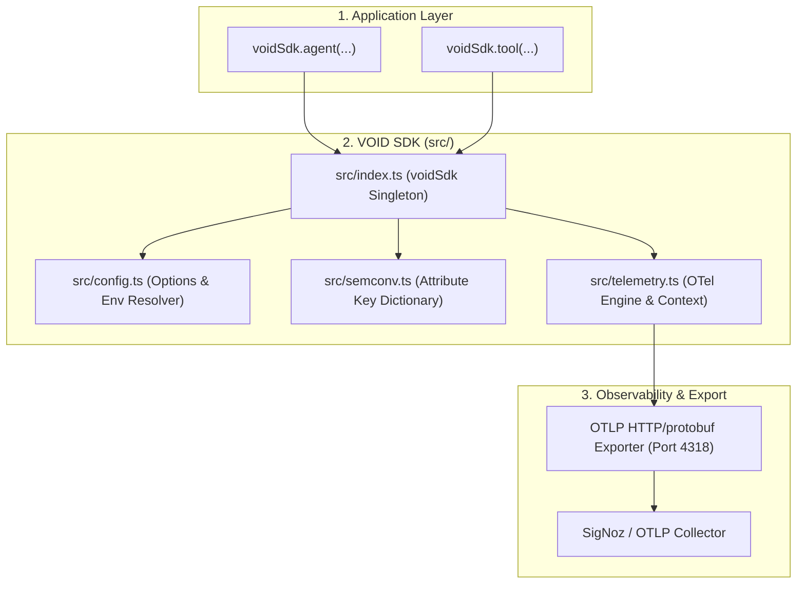
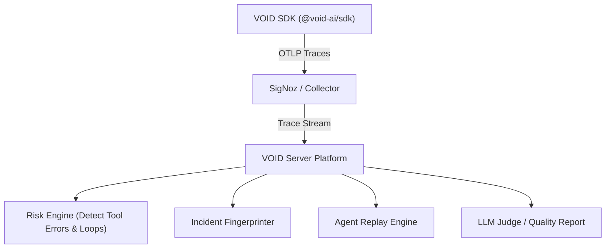

# VOID SDK

> **Vendor-neutral, OpenTelemetry-native telemetry layer for AI Agents.**

The **VOID SDK** (`@void-ai/sdk`) enables developers to produce rich, structured OpenTelemetry traces for AI Agent execution loops, tool calls, prompt iterations, and RAG memory lookups. It emits standard OTLP (HTTP/protobuf) to **SigNoz** or any OTLP-compatible collector.

> [!NOTE]  
> The SDK handles **telemetry emission only**. Incident qualification, agent replay, LLM evaluation, and reporting are handled asynchronously by the future **VOID Server**.

---

## Architecture Overview

Built following the **Ponytail Minimalist Philosophy**, the SDK eliminates unnecessary abstractions (`SpanBuilder`, `TracerManager`, `ContextManager`, custom YAML parsers) and encapsulates all OpenTelemetry complexity inside a **4-file source core**:



---

## 5-Minute Developer Quickstart

```typescript
import { voidSdk } from '@void-ai/sdk';

// 1. Initialize (Zero-config by default, reads env vars)
await voidSdk.init({
  serviceName: 'customer-support-agent',
});

// 2. Wrap Agent Execution
const response = await voidSdk.agent(
  { name: 'RefundAgent', role: 'customer-support', promptVersion: 'v2.1' },
  async () => {
    
    // 3. Wrap Tool Calls (Automatically linked as child spans)
    const tx = await voidSdk.tool(
      { name: 'lookupTransaction', input: { txId: 'tx_98765' } },
      async () => {
        return fetchTransaction('tx_98765');
      }
    );

    // 4. Record Custom Events or Attributes
    voidSdk.event('memory_lookup', { hit: true });

    return tx;
  }
);

// 5. Graceful Teardown (Required prior to explicit process.exit())
await voidSdk.shutdown();
```

> [!TIP]  
> The SDK registers process exit handlers for `SIGINT` and `SIGTERM`. If your process is terminated by standard system signals, pending spans are flushed automatically. Call `await voidSdk.shutdown()` before explicit `process.exit()` calls or in serverless environments.

---

## Source Structure (`src/`)

```
src/
├── index.ts        # Public API surface & voidSdk singleton export
├── telemetry.ts    # Encapsulated OTel NodeSDK, tracer, span lifecycle, & auto-exit
├── semconv.ts      # Standard attribute constants (GenAI, OpenInference, void.*)
└── config.ts       # Options parser & environment variable resolver
```

### Module Responsibilities

- **`index.ts`**: Developer facade exposing `init()`, `agent()`, `tool()`, `span()`, `event()`, `setAttribute()`, and `shutdown()`.
- **`telemetry.ts`**: Uses `tracer.startActiveSpan()` with Node's `AsyncHooksContextManager` to manage parent-child span nesting, status code recording, exception capturing, and signal process exit flushing.
- **`semconv.ts`**: Unified attribute key dictionary (`gen_ai.system`, `openinference.span.kind`, `void.agent.name`, `void.tool.name`, `void.tool.result`, `void.prompt.version`).
- **`config.ts`**: Resolves explicit options with `VOID_*` and `OTEL_*` environment variable fallbacks.

---

## SigNoz Integration

The VOID SDK requires **zero SigNoz-specific dependencies**. SigNoz natively ingests standard OTLP HTTP streams.

### Self-Hosted SigNoz
```typescript
await voidSdk.init({
  serviceName: 'my-agent-service',
  otlp: {
    endpoint: 'http://localhost:4318/v1/traces',
  },
});
```

Or via environment variables without code changes:
```bash
export OTEL_SERVICE_NAME="my-agent-service"
export VOID_OTLP_ENDPOINT="http://localhost:4318/v1/traces"
```

### SigNoz Cloud
SigNoz Cloud uses the standard `signoz-ingestion-key` header:

```typescript
await voidSdk.init({
  serviceName: 'production-agent',
  otlp: {
    endpoint: 'https://ingest.us.signoz.cloud:443/v1/traces',
    headers: {
      'signoz-ingestion-key': process.env.SIGNOZ_INGESTION_KEY!,
    },
  },
});
```

---

## Framework Agnostic

The VOID SDK is **100% agent framework agnostic**. It works seamlessly with **LangChain.js, Vercel AI SDK, AutoGen.js**, or custom TypeScript/JavaScript agent loops:

```typescript
// Example with LangChain.js / Custom Async Function
await voidSdk.agent({ name: 'LangChainAgent' }, async () => {
  return await agentExecutor.invoke({ input: 'Process refund' });
});
```

*(For Python agents using CrewAI or PydanticAI, use OpenTelemetry Python OTLP exporters emitting standard `openinference.*` and `void.*` attributes).*

---

## Future VOID Server Integration

The SDK emits standard OTLP spans tagged with `void.*` semantic conventions. The future **VOID Server** will consume this trace stream to perform:



1. **Incident Qualification**: Queries spans where `void.tool.result = "error"` or detects looping child spans under `void.agent.name`.
2. **Execution Replay**: Reconstructs execution trees using standard OTel `traceId`, `spanId`, and `parentSpanId`.
3. **Inline Signals**: Emits custom evaluator events via `voidSdk.event()`.

---

## Building & Testing

Unit and integration tests use an in-memory exporter and require **zero external running services**:

```bash
# Typecheck TypeScript
npm run typecheck

# Build ESM & CommonJS bundles via tsup
npm run build

# Run Vitest unit & integration test suite (fully self-contained)
npm test
```

---

## License

MIT
