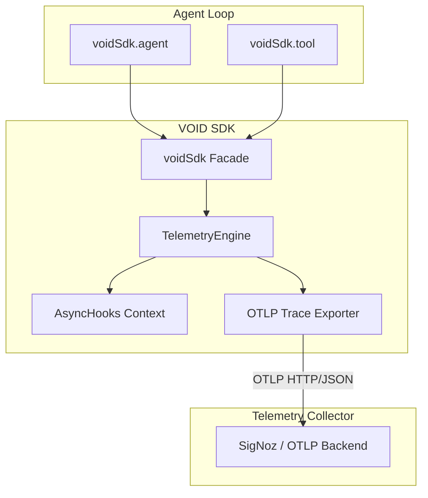

# @void-hq/sdk

> **OpenTelemetry-Native Telemetry SDK for AI Agents**

`@void-hq/sdk` is a lightweight, zero-dependency vendor-neutral SDK that automatically instruments AI Agent execution loops, tool calls, and prompt reasoning pipelines. It emits standard OpenTelemetry (OTLP) trace streams directly to **SigNoz Cloud**, **Self-Hosted SigNoz**, or any OTLP-compliant collector.

---

## Features

- 🤖 **AI-Native Instrumentation**: First-class abstractions for `agent()`, `tool()`, `span()`, and `event()`.
- ⚡ **OpenTelemetry Native**: Native OTLP/HTTP exporter sending spans according to `openinference` and GenAI semantic conventions.
- 🎯 **SigNoz Ready**: Native support for SigNoz Cloud (ingestion key headers) and Self-Hosted SigNoz instances.
- 🛡️ **Fail-Safe Execution**: Zero-impact error isolation ensures telemetry errors never break production agent loops.
- 📦 **Circular & BigInt Safe**: Handles circular JSON references, functions, symbols, and BigInt values without throwing.

---

## Architecture Overview



---

## 5-Minute Developer Quickstart

The SDK requires zero low-level OpenTelemetry setup. Signal handlers (`SIGINT`/`SIGTERM`) flush pending spans automatically upon exit, though calling `await voidSdk.shutdown()` is recommended before explicit `process.exit()` calls or in serverless environments.

```typescript
import { voidSdk } from '@void-hq/sdk';

// 1. Initialize (Zero-config by default, reads env vars)
await voidSdk.init({
  serviceName: 'customer-support-agent',
});

// 2. Wrap Agent Execution
const response = await voidSdk.agent(
  { name: 'RefundAgent', role: 'customer-support', promptVersion: 'v2.1' },
  async (agentSpan) => {
    
    // 3. Instrument Tool Execution
    const tx = await voidSdk.tool(
      { name: 'lookupTransaction', input: { txId: 'tx_992481' } },
      async (toolSpan) => {
        return await fetchTransaction('tx_992481');
      }
    );

    // 4. Record Custom Telemetry Events & Attributes
    voidSdk.event('memory_lookup_hit', { docsReturned: 4 });
    voidSdk.setAttribute('customer.tier', 'gold');

    return tx;
  }
);

// 5. Graceful Teardown (Recommended prior to explicit process.exit() or serverless finish)
await voidSdk.shutdown();
```

> [!TIP]  
> The SDK registers process exit handlers for `SIGINT` and `SIGTERM`. If your process is terminated by standard system signals, pending spans are flushed automatically. Call `await voidSdk.shutdown()` before explicit `process.exit()` calls or in serverless environments.

---

## Source Structure (`src/`)

```
src/
├── index.ts        # Primary developer facade and public exports
├── telemetry.ts    # OpenTelemetry TracerProvider & AsyncHooks context manager
├── config.ts       # Environment variable resolution & endpoint parser
└── semconv.ts      # GenAI and OpenInference semantic convention constants
```

### Module Responsibilities

- **`index.ts`**: Developer facade exposing `init()`, `agent()`, `tool()`, `span()`, `event()`, `setAttribute()`, and `shutdown()`.
- **`telemetry.ts`**: Uses `tracer.startActiveSpan()` with Node's `AsyncHooksContextManager` to manage parent-child span nesting, status code recording, exception capturing, and signal process exit flushing.
- **`semconv.ts`**: Unified attribute key dictionary (`gen_ai.system`, `openinference.span.kind`, `void.agent.name`, `void.tool.name`, `void.tool.result`, `void.prompt.version`).
- **`config.ts`**: Resolves explicit options with `VOID_*` and `OTEL_*` environment variable fallbacks.

---

## Configuration & Environment Variables

The SDK evaluates configuration in the following precedence order:
`Explicit init(options)` > `VOID_* Env Vars` > `OTEL_* Env Vars` > `Defaults`

| Parameter | Environment Variable | Default Value | Description |
| :--- | :--- | :--- | :--- |
| `serviceName` | `VOID_SERVICE_NAME` / `OTEL_SERVICE_NAME` | `void-agent-service` | Service identifier tag |
| `environment` | `VOID_ENVIRONMENT` / `NODE_ENV` | `development` | Environment tag (`production`, `staging`) |
| `endpoint` | `VOID_OTLP_ENDPOINT` / `OTEL_EXPORTER_OTLP_TRACES_ENDPOINT` | `http://localhost:4318/v1/traces` | Target OTLP HTTP receiver URL |
| `headers` | `VOID_OTLP_HEADERS` / `OTEL_EXPORTER_OTLP_HEADERS` | `{}` | Key=value headers (e.g. SigNoz keys) |
| `disabled` | `VOID_DISABLED` | `false` | Disables telemetry when set to `true` |

---

## SigNoz Integration

### Self-Hosted SigNoz (Local Docker or K8s)
By default, Self-Hosted SigNoz receives OTLP HTTP traces at port `4318`:

```typescript
await voidSdk.init({
  serviceName: 'my-local-agent',
  otlp: {
    endpoint: 'http://localhost:4318/v1/traces',
  },
});
```

### SigNoz Cloud
SigNoz Cloud uses the standard `signoz-ingestion-key` header:

```typescript
await voidSdk.init({
  serviceName: 'production-agent',
  otlp: {
    endpoint: 'https://ingest.us.signoz.cloud:443/v1/traces',
    headers: {
      'signoz-ingestion-key': process.env.SIGNOZ_INGESTION_KEY!,
    },
  },
});
```

---

## Framework Agnostic

The VOID SDK is **100% agent framework agnostic**. It works seamlessly with **LangChain.js, Vercel AI SDK, AutoGen.js**, or custom TypeScript/JavaScript agent loops:

```typescript
await voidSdk.agent({ name: 'LangChainAgent' }, async () => {
  return await agentExecutor.invoke({ input: 'Process refund' });
});
```

*(For Python agents using CrewAI or PydanticAI, use OpenTelemetry Python OTLP exporters emitting standard `openinference.*` and `void.*` attributes).*

---

## Building & Testing

Unit and integration tests use an in-memory exporter and require **zero external running services**:

```bash
# Typecheck TypeScript
npm run typecheck

# Build ESM & CommonJS bundles via tsup
npm run build

# Run Vitest unit & integration test suite (fully self-contained)
npm test
```

---

## License

MIT © VOID
